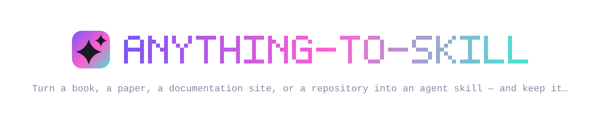
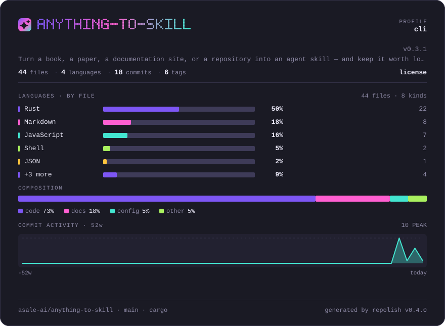
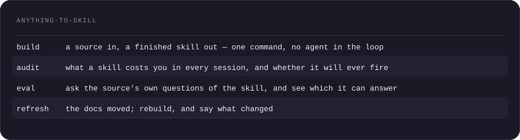
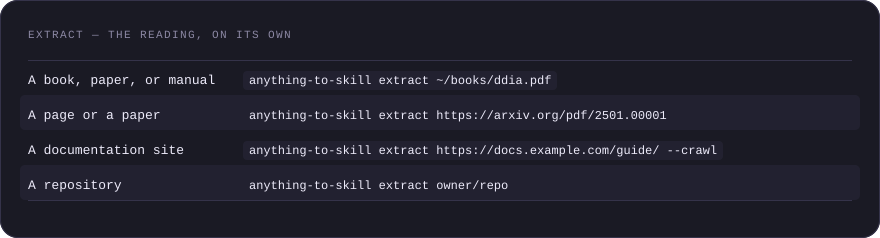
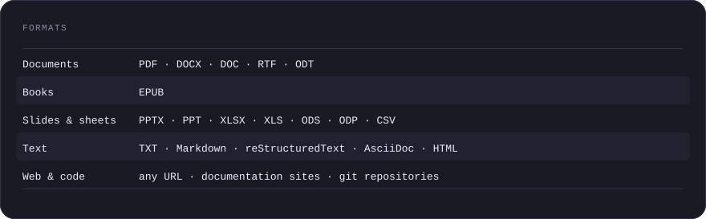
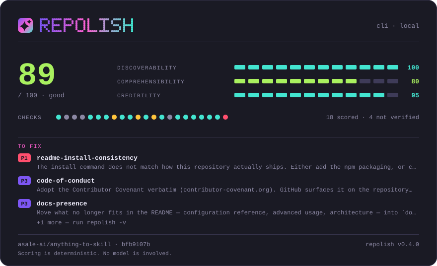

# anything-to-skill

**Turn a book, a paper, a documentation site, or a repository into an agent
skill — and keep it worth loading afterwards.**

[](https://github.com/asale-ai/anything-to-skill/actions/workflows/ci.yml)
[](https://crates.io/crates/anything-to-skill)
[](LICENSE)
[](https://github.com/asale-ai/repolish)




Four verbs, for Claude Code, Codex, Gemini CLI, opencode, and anything else
that loads skills from a directory:



<details>
<summary>anything-to-skill as a table</summary>

| | |
|---|---|
| **`build`** | a source in, a finished skill out — one command, no agent in the loop |
| **`audit`** | what a skill costs you in every session, and whether it will ever fire |
| **`eval`** | ask the source's own questions of the skill, and see which it can answer |
| **`refresh`** | the docs moved; rebuild, and say what changed |

</details>

`extract` is still there underneath, for when you would rather read the source
yourself and write the skill by hand. That is the default route, and the better
one when you care about the result.

## Contents

- [Install](#install)
- [audit — what your skills already cost you](#audit--what-your-skills-already-cost-you)
- [build — a source in, a skill out](#build--a-source-in-a-skill-out)
- [eval — does the skill still know the book?](#eval--does-the-skill-still-know-the-book)
- [refresh — documentation moves](#refresh--documentation-moves)
- [extract — the reading, on its own](#extract--the-reading-on-its-own)
- [Formats](#formats)
- [Agents without a shell](#agents-without-a-shell)

## Install

```bash
npx @asale/anything-to-skill audit
```

That is the whole install. `npx` fetches a small launcher; the launcher fetches
the binary for your platform out of this project's GitHub release, checks it
against the release's published SHA256, and refuses to unpack anything that
does not match. `HTTP_PROXY`, `HTTPS_PROXY` and `NO_PROXY` are honoured.

Fetching it on every run gets old, so keep it:

```bash
npm install -g @asale/anything-to-skill
```

The skill itself — the instructions your agent loads — goes in separately, into
every agent tool on the machine:

```bash
npx skills add asale-ai/anything-to-skill --all -g
```

That writes `~/.agents/skills/anything-to-skill/` — the path Codex, Cursor,
Gemini CLI, and opencode read directly — and symlinks it into the ones that
look elsewhere, Claude Code's `~/.claude/skills/` among them. Drop `-g` to
install into the current project instead.

<details>
<summary><strong>Without Node</strong></summary>

The npm package needs Node 18 or later. On a machine without it:

```bash
curl -fsSL https://raw.githubusercontent.com/asale-ai/anything-to-skill/main/install.sh | sh
```

On Windows, in PowerShell:

```powershell
irm https://raw.githubusercontent.com/asale-ai/anything-to-skill/main/install.ps1 | iex
```

Pipe to `SKILL=1 sh` instead — or set `$env:SKILL = '1'` before the PowerShell
line — and the installer places the skill as well as the binary. Both verify
the download against the release's published SHA256 and install nothing if it
does not match. Set `BIN_DIR` (`$env:BIN_DIR`) to install somewhere other than
`~/.local/bin`; `$env:ADD_TO_PATH = '1'` puts that directory on your PATH on
Windows.

With Rust already installed, `cargo install anything-to-skill` builds it from
source.

</details>

---

## audit — what your skills already cost you

Start here, before you make another one. No API key, no network:

```bash
anything-to-skill audit
```

It finds the skills directories on the machine and grades every skill in them:

```
wrangler  60 always-loaded / 3225 on trigger / 0 on demand (0 reference file(s))
  /Users/you/.claude/skills/wrangler/SKILL.md
    warning: description names the subject but never the situation
      -> add an explicit trigger — "Use when the user ..." — with the words a
         user would actually type
    warning: SKILL.md body is ~3225 tokens against a budget of 2000
      -> move the lookup material — tables, syntax, command lists — into
         `references/` and link to it from the body

Across the tree:
    warning: `sandbox-next` and `sandbox-stable` describe themselves with the
             same terms (apps, building, changing, cloudflare, default, files,
             next, package, porting, sandbox, stable, terminals, tunnels)
      -> make each description say what the other one is *not* for, or merge them

15 skill(s)
  1026 tokens are loaded in every session before any skill fires
  heaviest body: turnstile-spin at ~4590 tokens (budget 2000)
  1 error(s), 10 warning(s)
```

Three numbers, because they are not paid at the same time. The **description**
is loaded in every session whether the skill fires or not. The **body** is
loaded when it fires. **`references/`** is loaded only if the body sends you
there. A skill that keeps its body small by pushing detail into `references/`
costs nothing extra until somebody needs it — and one that does not, taxes
every unrelated task you run that day.

It also catches the failures that are invisible from inside one skill: two
skills describing themselves with the same words, so routing between them is a
coin flip; links into `references/` that go nowhere; reference files nothing
links to. `--strict` fails on warnings, `--json` is for scripts, and both make
it a CI gate.

## build — a source in, a skill out

```bash
anything-to-skill build https://docs.pytest.org/en/stable/ --crawl \
    --purpose working-guide --out ./skills
```

It reads in two passes — notes on each section, then the skill from the notes —
so nothing ever has to hold the whole book and the whole answer at once. Then
it audits what it wrote, because a tool that generates skills and does not
grade its own output is asking you to trust it twice.

`--purpose` is the choice that changes the result most: `reference` (look it up
fast), `working-guide` (apply it), or `deep-study` (learn it, reasoning
included). `--dry-run` prints the plan and makes no requests:

```
$ anything-to-skill build ./SKILL.md references/*.md --purpose reference --dry-run

building `a2s-docs` for `reference`
  model     (none — dry run)
  reading   1 section(s), ~4842 tokens
  writing   ./skills/a2s-docs

--dry-run: stopping before the first request.
```

`build` needs `ANTHROPIC_API_KEY`. Nothing else here does.

## eval — does the skill still know the book?

```bash
anything-to-skill eval ./skills/ddia --questions 12
```

Every other skill tool grades a skill against itself: it asks a model whether
the skill looks good. That test cannot fail for the right reason, because
nothing in it knows what the skill was supposed to contain.

This one has the source. The questions come from the source, the skill answers
with nothing but itself, and the answers are graded against the source. The
pass rate is the headline and the failures are the point — each names the
section its question came from, so the report ends with the parts of the book
the skill did not carry. `--min-pass 80` exits non-zero below that.

## refresh — documentation moves

A skill built from a docs site is a snapshot of something that changes.
`build` records what it read in `.a2s.lock`, so this can be answered later:

```
$ anything-to-skill refresh ./skills/pytest --check

the sources moved since 2026-08-01T09:14:00Z (2274 -> 2684 tokens)
  changed: https://docs.pytest.org/en/stable/how-to/fixtures.html
```

`--check` changes nothing and exits 1 when the source moved — a scheduled job
that opens a pull request. Without it, the skill is rebuilt and the change is
written to the skill's own `CHANGELOG.md`. Every document carries its own
fingerprint, so the report names the pages that moved rather than only telling
you that something did.

---

## extract — the reading, on its own

Point your agent at a source and it gets text back, not a page of markup with
the documentation buried in it:

````
# Installation - The Rust Programming Language

source: https://doc.rust-lang.org/book/ch01-01-installation.html

The first step is to install Rust. We'll download Rust through rustup, a
command line tool for managing Rust versions and associated tools. [...]

```
$ curl --proto '=https' --tlsv1.2 https://sh.rustup.rs -sSf | sh
```
````

The navigation, the sidebar, the version switcher and the footer are gone. The
code block kept its indentation. The page says where it came from — a crawl
concatenates dozens of pages, and a claim you cannot trace is a claim you
cannot check.



<details>
<summary>extract — the reading, on its own as a table</summary>

| | |
|---|---|
| **A book, paper, or manual** | `anything-to-skill extract ~/books/ddia.pdf` |
| **A page or a paper** | `anything-to-skill extract https://arxiv.org/pdf/2501.00001` |
| **A documentation site** | `anything-to-skill extract https://docs.example.com/guide/ --crawl` |
| **A repository** | `anything-to-skill extract owner/repo` |

</details>

**Sites** are crawled one request at a time, on the same host, at or below the
directory you named, bounded by `--max-pages` and `--depth`, and `robots.txt` is
honoured. When a site publishes its documentation as an `llms.txt`, that is read
instead of crawling — the site's own curated text, in one request:

```
$ anything-to-skill extract https://svelte.dev/ --crawl
crawling https://svelte.dev/ ...
  https://svelte.dev/llms-full.txt — reading it instead of crawling

extracted 1 document(s) from 1 source(s)
  1179728 characters, ~208777 tokens
```

**Repositories** are shallow-cloned and read in the order a person opens one:
the README, then `docs/`, then the rest. Prose only — pass `--include` when the
source itself is the documentation.

Whatever a run could *not* read is written to `metadata.json` and repeated on
screen: a crawl that stopped at its page limit, pages `robots.txt` withheld, PDF
pages with no extractable text. A skill whose gaps are stated is usable; one
that hides them is a trap for whoever loads it next.

Run `anything-to-skill sources` for every accepted form — SSH remotes, `tree`
and `blob` URLs, branches, subdirectories.

## Formats



<details>
<summary>Formats as a table</summary>

| | |
|---|---|
| **Documents** | PDF · DOCX · DOC · RTF · ODT |
| **Books** | EPUB |
| **Slides & sheets** | PPTX · PPT · XLSX · XLS · ODS · ODP · CSV |
| **Text** | TXT · Markdown · reStructuredText · AsciiDoc · HTML |
| **Web & code** | any URL · documentation sites · git repositories |

</details>

Repositories need [git](https://git-scm.com/downloads). Kindle (MOBI · AZW ·
AZW3) needs [Calibre](https://calibre-ebook.com/download). PDFs come out better
with [poppler](https://poppler.freedesktop.org/) installed (`brew install
poppler`), and `--engine docling` hands them to
[Docling](https://github.com/docling-project/docling) instead when a document's
tables matter more than the time. Run `anything-to-skill check` to see what you
have.

## Agents without a shell

```bash
anything-to-skill mcp
```

Serves `extract`, `read_text`, `audit` and `sources` over MCP on stdio, so an
agent that cannot run a command can still read a source and grade a skill.
`build` and `eval` are deliberately absent: an agent on the other end of MCP
already is the model.

---

[SKILL.md](SKILL.md) · [commands](references/commands.md) · [CONTRIBUTING.md](CONTRIBUTING.md) · [SECURITY.md](SECURITY.md) · Apache-2.0

## Polished with repolish



This card is generated by [repolish](https://github.com/asale-ai/repolish) and is a plain file in this repository — no external fonts, no scripts, nothing hosted by a third party. To score your own: `npx @asale/repolish`.

