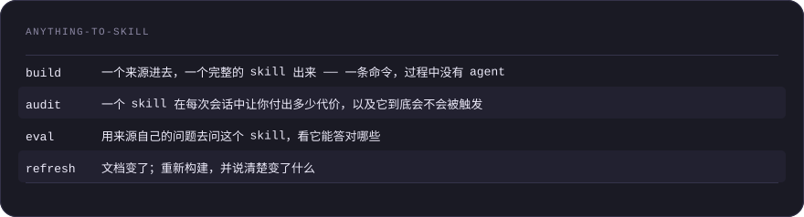
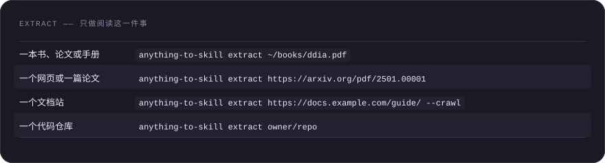
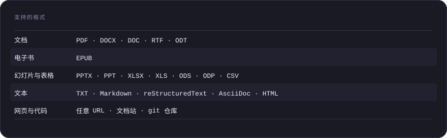

# anything-to-skill

**把一本书、一篇论文、一个文档站或一个代码仓库变成 agent skill —— 并且让它在此之后依然值得被加载。**

[](https://github.com/asale-ai/anything-to-skill/actions/workflows/ci.yml)
[](https://crates.io/crates/anything-to-skill)
[](LICENSE)
[](https://github.com/asale-ai/repolish)

[English](README.md) · **简体中文**





四个动词，服务于 Claude Code、Codex、Gemini CLI、opencode，以及任何从目录里加载
skill 的工具：



<details>
<summary>anything-to-skill as a table</summary>

| | |
|---|---|
| **`build`** | 一个来源进去，一个完整的 skill 出来 —— 一条命令，过程中没有 agent |
| **`audit`** | 一个 skill 在每次会话中让你付出多少代价，以及它到底会不会被触发 |
| **`eval`** | 用来源自己的问题去问这个 skill，看它能答对哪些 |
| **`refresh`** | 文档变了；重新构建，并说清楚变了什么 |

</details>

底层的 `extract` 依然在，适合你更愿意自己读来源、手写 skill 的时候。那才是默认路线，
也是你在意结果时更好的那条路。

## 目录

- [安装](#安装)
- [audit —— 你现有的 skill 到底花了你多少](#audit--你现有的-skill-到底花了你多少)
- [build —— 一个来源进，一个 skill 出](#build--一个来源进一个-skill-出)
- [eval —— 这个 skill 还记得那本书吗？](#eval--这个-skill-还记得那本书吗)
- [refresh —— 文档是会变的](#refresh--文档是会变的)
- [extract —— 只做阅读这一件事](#extract--只做阅读这一件事)
- [支持的格式](#支持的格式)
- [没有 shell 的 agent](#没有-shell-的-agent)

## 安装

```bash
npx @asale/anything-to-skill audit
```

安装就到此为止。`npx` 拉一个很小的启动器；启动器再从本项目的 GitHub release 里取回
对应平台的二进制，用 release 中公布的 SHA256 校验，对不上就拒绝解包。`HTTP_PROXY`、
`HTTPS_PROXY` 和 `NO_PROXY` 都会被遵守。

每次运行都重新下载会很烦，所以把它留下来：

```bash
npm install -g @asale/anything-to-skill
```

skill 本身 —— 也就是你的 agent 会加载的那份说明 —— 是单独装的，一次装进机器上所有
agent 工具：

```bash
npx skills add asale-ai/anything-to-skill --all -g
```

这会写入 `~/.agents/skills/anything-to-skill/` —— Codex、Cursor、Gemini CLI 和
opencode 直接读的路径 —— 并向那些去别处找的工具做符号链接，其中包括 Claude Code 的
`~/.claude/skills/`。去掉 `-g` 就只装到当前项目。

<details>
<summary><strong>没有 Node 的情况</strong></summary>

npm 包需要 Node 18 或更高版本。机器上没有的话：

```bash
curl -fsSL https://raw.githubusercontent.com/asale-ai/anything-to-skill/main/install.sh | sh
```

Windows 上，在 PowerShell 里：

```powershell
irm https://raw.githubusercontent.com/asale-ai/anything-to-skill/main/install.ps1 | iex
```

改成管道给 `SKILL=1 sh` —— 或者在 PowerShell 那行之前设置 `$env:SKILL = '1'` ——
安装器就会连 skill 一起装，而不只是二进制。两者都会用 release 中公布的 SHA256 校验
下载内容，对不上就什么都不装。设置 `BIN_DIR`（`$env:BIN_DIR`）可以装到
`~/.local/bin` 以外的地方；`$env:ADD_TO_PATH = '1'` 会在 Windows 上把该目录加进 PATH。
把脚本下载下来运行（而不是管道执行）时，`install.sh` 也接受同样的选项作为命令行
参数 —— `sh install.sh --help` 会列出来；`install.ps1` 本来就接受这些参数。

已经装了 Rust 的话，`cargo install anything-to-skill` 可以从源码构建。

</details>

---

## audit —— 你现有的 skill 到底花了你多少

从这里开始，在你再造一个之前。不需要 API key，不联网：

```bash
anything-to-skill audit
```

它会找到机器上的 skill 目录，给里面每一个 skill 打分：

```
wrangler  60 always-loaded / 3225 on trigger / 0 on demand (0 reference file(s))
  /Users/you/.claude/skills/wrangler/SKILL.md
    warning: description names the subject but never the situation
      -> add an explicit trigger — "Use when the user ..." — with the words a
         user would actually type
    warning: SKILL.md body is ~3225 tokens against a budget of 2000
      -> move the lookup material — tables, syntax, command lists — into
         `references/` and link to it from the body

Across the tree:
    warning: `sandbox-next` and `sandbox-stable` describe themselves with the
             same terms (apps, building, changing, cloudflare, default, files,
             next, package, porting, sandbox, stable, terminals, tunnels)
      -> make each description say what the other one is *not* for, or merge them

15 skill(s)
  1026 tokens are loaded in every session before any skill fires
  heaviest body: turnstile-spin at ~4590 tokens (budget 2000)
  1 error(s), 10 warning(s)
```

三个数字，因为它们不是在同一时刻付出的。**description** 无论 skill 是否触发，每次
会话都会被加载。**正文** 在触发时才加载。**`references/`** 只有在正文把你引过去时
才加载。一个把细节推进 `references/`、保持正文精简的 skill，在真有人需要之前不会多
花一分；而做不到这点的 skill，会向你那天跑的每一个不相干的任务收税。

它也会抓出那些从单个 skill 内部看不见的问题：两个 skill 用同样的措辞描述自己，于是
它们之间的路由变成抛硬币；指向 `references/` 却指空的链接；没有任何地方链接到的
reference 文件。`--strict` 让警告也算失败，`--json` 给脚本用，两者都能把它变成 CI 关卡。

## build —— 一个来源进，一个 skill 出

```bash
anything-to-skill build https://docs.pytest.org/en/stable/ --crawl \
    --purpose working-guide --out ./skills
```

它分两遍读：先对每一节做笔记，再从笔记写出 skill —— 这样任何时候都不需要同时装下
整本书和整份答案。写完之后它会审计自己的产出，因为一个只管生成 skill、却不给自己的
输出打分的工具，是在要求你信任它两次。

`--purpose` 是对结果影响最大的选择：`reference`（快速查阅）、`working-guide`（拿来
就用）或 `deep-study`（学懂它，连推理一起）。`--dry-run` 只打印计划，不发任何请求：

```
$ anything-to-skill build ./SKILL.md references/*.md --purpose reference --dry-run

building `a2s-docs` for `reference`
  model     (none — dry run)
  reading   1 section(s), ~4842 tokens
  writing   ./skills/a2s-docs

--dry-run: stopping before the first request.
```

`build` 需要 `ANTHROPIC_API_KEY`。这里其他命令都不需要。

## eval —— 这个 skill 还记得那本书吗？

```bash
anything-to-skill eval ./skills/ddia --questions 12
```

其他所有 skill 工具都是拿 skill 跟它自己比：让模型评价这个 skill 看上去好不好。这种
测试不可能因为正确的理由而失败，因为其中没有任何东西知道这个 skill 本该包含什么。

这一个手里有来源。问题出自来源，skill 只凭自己作答，答案再对着来源判分。通过率是标题
数字，而失败才是重点 —— 每一条失败都会指出它的问题来自哪一节，所以报告的结尾就是这本书
中 skill 没有承载的那些部分。`--min-pass 80` 会在低于该分数时以非零码退出。

## refresh —— 文档是会变的

从文档站构建出来的 skill，是某个会变的东西的一张快照。`build` 会把它读过的内容记进
`.a2s.lock`，于是这个问题以后还能被回答：

```
$ anything-to-skill refresh ./skills/pytest --check

the sources moved since 2026-08-01T09:14:00Z (2274 -> 2684 tokens)
  changed: https://docs.pytest.org/en/stable/how-to/fixtures.html
```

`--check` 什么都不改，来源变了就退出 1 —— 正好是一个定时任务用来开 pull request 的
方式。不加它，skill 会被重建，变更会写进该 skill 自己的 `CHANGELOG.md`。每份文档都
带着自己的指纹，所以报告会点名哪些页面变了，而不是只告诉你"有东西变了"。

---

## extract —— 只做阅读这一件事

把你的 agent 指向一个来源，它拿回来的是文本，而不是一页把文档埋在里面的标记：

````
# Installation - The Rust Programming Language

source: https://doc.rust-lang.org/book/ch01-01-installation.html

The first step is to install Rust. We'll download Rust through rustup, a
command line tool for managing Rust versions and associated tools. [...]

```
$ curl --proto '=https' --tlsv1.2 https://sh.rustup.rs -sSf | sh
```
````

导航、侧边栏、版本切换器和页脚都没了。代码块保住了自己的缩进。页面会说明它来自哪里 ——
一次爬取会把几十个页面拼在一起，而一个你无法追溯的说法，就是一个你无法核实的说法。



<details>
<summary>extract —— 只做阅读这一件事 as a table</summary>

| | |
|---|---|
| **一本书、论文或手册** | `anything-to-skill extract ~/books/ddia.pdf` |
| **一个网页或一篇论文** | `anything-to-skill extract https://arxiv.org/pdf/2501.00001` |
| **一个文档站** | `anything-to-skill extract https://docs.example.com/guide/ --crawl` |
| **一个代码仓库** | `anything-to-skill extract owner/repo` |

</details>

**站点** 是一次一个请求地爬的，只在同一主机上，只在你指定的目录及其下层，受
`--max-pages` 和 `--depth` 约束，并且遵守 `robots.txt`。当一个站点以 `llms.txt`
形式发布自己的文档时，就读它而不再爬取 —— 站点自己整理好的文本，一次请求就够：

```
$ anything-to-skill extract https://svelte.dev/ --crawl
crawling https://svelte.dev/ ...
  https://svelte.dev/llms-full.txt — reading it instead of crawling

extracted 1 document(s) from 1 source(s)
  1179728 characters, ~208777 tokens
```

**仓库** 会被浅克隆，并按一个人打开它的顺序来读：先 README，然后 `docs/`，再是其余
部分。只读散文 —— 当来源本身就是文档时，加上 `--include`。

一次运行中**读不到**的内容会写进 `metadata.json`，并在屏幕上重复一遍：在页数上限处
停下的爬取、被 `robots.txt` 挡住的页面、没有可提取文本的 PDF 页。一个把自己缺口说清楚
的 skill 是可用的；一个把缺口藏起来的，是给下一个加载它的人挖的坑。

运行 `anything-to-skill sources` 可以看到所有被接受的写法 —— SSH remote、`tree` 和
`blob` URL、分支、子目录。

## 支持的格式



<details>
<summary>支持的格式 as a table</summary>

| | |
|---|---|
| **文档** | PDF · DOCX · DOC · RTF · ODT |
| **电子书** | EPUB |
| **幻灯片与表格** | PPTX · PPT · XLSX · XLS · ODS · ODP · CSV |
| **文本** | TXT · Markdown · reStructuredText · AsciiDoc · HTML |
| **网页与代码** | 任意 URL · 文档站 · git 仓库 |

</details>

仓库需要 [git](https://git-scm.com/downloads)。Kindle（MOBI · AZW · AZW3）需要
[Calibre](https://calibre-ebook.com/download)。装了
[poppler](https://poppler.freedesktop.org/)（`brew install poppler`）之后 PDF 的
效果更好；而当一份文档的表格比耗时更重要时，`--engine docling` 会把它交给
[Docling](https://github.com/docling-project/docling) 处理。运行
`anything-to-skill check` 看看你手上有哪些。

## 没有 shell 的 agent

```bash
anything-to-skill mcp
```

通过 stdio 上的 MCP 提供 `extract`、`read_text`、`audit` 和 `sources`，这样一个不能
执行命令的 agent 也依然可以读来源、给 skill 打分。`build` 和 `eval` 是刻意缺席的：
MCP 另一端的 agent 本身就是那个模型。

---

[SKILL.md](SKILL.md) · [命令参考](references/commands.md) · [CONTRIBUTING.md](CONTRIBUTING.md) · [SECURITY.md](SECURITY.md) · Apache-2.0

## 由 repolish 打磨


这张卡片由 [repolish](https://github.com/asale-ai/repolish) 生成，是本仓库里的一个
普通文件 —— 没有外部字体，没有脚本，没有任何第三方托管的东西。给你自己的项目打分：
`npx @asale/repolish`。
